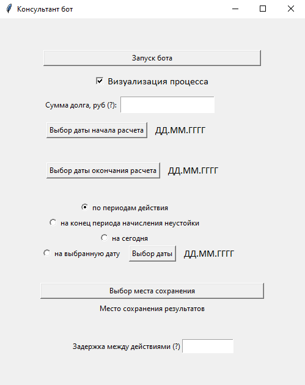
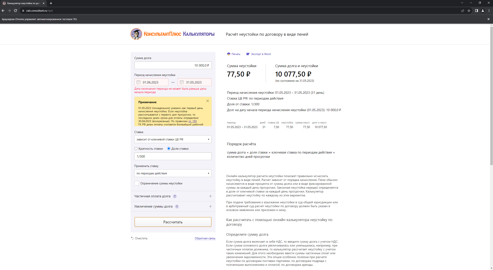

# Консультант-бот (пени)

Консультант-бот - ПО для автоматизации расчета неустойки по договору в виде пеней помесячно в сервисе "КонсультантПлюс".

Проект основан на Selenium'е.

Работа приложения:

